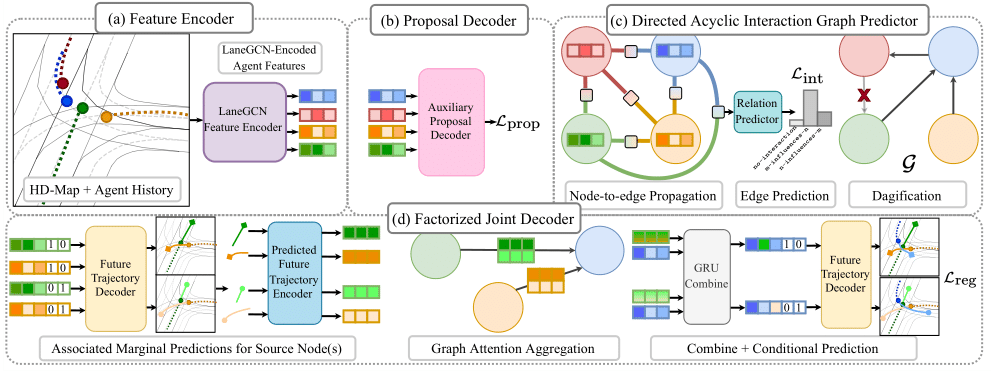

# FJMP: Factorized Joint Multi-Agent Motion Prediction over Learned Directed Acyclic Interaction Graphs


  [Paper](https://arxiv.org/abs/2211.16197) | [Project Page](https://rluke22.github.io/FJMP/) | [YouTube Video](https://www.youtube.com/watch?v=asmCOhPQuNw&ab_channel=RLuke22) 

**[Luke Rowe](https://www.linkedin.com/in/rluke22/), [Martin Ethier](https://www.linkedin.com/in/ethiermartin/), [Eli-Henry Dykhne](https://www.linkedin.com/in/henry-dykhne-ai), [Krzysztof Czarnecki](https://uwaterloo.ca/electrical-computer-engineering/profile/k2czarne)** \
[WISE Lab, University of Waterloo](https://uwaterloo.ca/waterloo-intelligent-systems-engineering-lab/) \
[CVPR 2023](https://cvpr2023.thecvf.com/)

**Ranks 1st** in INTERACTION Multi-Agent Prediction Benchmark



Table of Contents
=================
  * [Results](#results)
  * [Setup](#setup)
  * [Preprocess Data](#preprocess-data)
  * [Training](#training)
  * [Evaluation](#eval)
  * [Visualization](#visualization)
  * [Submitting to INTERACTION Leaderboard](#submit)
  * [License](#license)
  * [Citation](#citation)

## Results

The expected performance (joint metrics) on the INTERACTION validation set:

| Model | minFDE | minADE | iminFDE | iminADE |
| :--- | :---: | :---: | :---: | :---: |
| FJMP | 0.63 | 0.19 | 0.67 | 0.21 |

The expected performance (joint metrics) on the Argoverse 2 validation set:

| Model | Actors | minFDE | minADE | iminFDE | iminADE |
| :--- | :---: | :---: | :---: | :---: | :---: |
| FJMP | All | 1.96 | 0.81 | 3.20 | 1.27 |
| FJMP | Scored | 1.92 | 0.82 | 2.89 | 1.20 |

## Setup

Start by cloning the repository
```
git clone https://github.com/RLuke22/FJMP
cd FJMP
```

### Download INTERACTION Dataset

To retrieve the INTERACTION dataset, you must submit a request form, which can be found on the INTERACTION dataset [website](http://interaction-dataset.com/). Once you attain access to the INTERACTION dataset, download the "Data for Multi-Agent Tracks", and place the contents in the ```INTERACTION-Dataset-DR-multi-v1_2``` directory into the ```dataset_INTERACTION``` directory.


### Download Argoverse 2 Dataset

Follow the instructions [here](https://argoverse.github.io/user-guide/getting_started.html#downloading-the-data) to download the Argoverse 2 motion forecasting data. Place the ```train```, ```val```, and ```test``` directories into the ```dataset_AV2``` directory.

### Conda Setup

Run the following code to install the necessary dependencies:
```
conda create --name FJMP python=3.8
conda activate FJMP
conda install pytorch==1.9.0 cudatoolkit=11.1 -c pytorch -c conda-forge

# install argoverse api
pip install git+https://github.com/argoai/argoverse-api.git 
# install dgl
pip install dgl-cu111 -f https://data.dgl.ai/wheels/repo.html

# install other dependencies
pip install -r misc/requirements.txt

# install av2 api
pip install av2==0.2.1

# install mpi4py (for horovod)
pip install mpi4py==3.1.4

# install horovod
HOROVOD_GPU_OPERATIONS=NCCL pip install horovod==0.19.4

# install lanelet2 (needed for INTERACTION map preprocessing)
pip install lanelet2
```

### Docker Setup

We also provide a Dockerfile to fully reproduce the environment used to train/evaluate FJMP models. To build the Docker image and run the Docker container, run:

```
cd docker_images
# put path/to/FJMP in run.sh file
bash ./run.sh
```

## Preprocess Data

INTERACTION data preprocessing:
```
python3 fjmp_preprocess_interaction.py
```

As the Argoverse 2 dataset is considerably larger, we preprocess the data in chunks (which can be done in parallel):
```
python3 build_mapping_dict_argoverse2.py
python3 fjmp_preprocess_argoverse2.py --mode train --region 0
python3 fjmp_preprocess_argoverse2.py --mode train --region 1
python3 fjmp_preprocess_argoverse2.py --mode train --region 2
python3 fjmp_preprocess_argoverse2.py --mode train --region 3
python3 fjmp_preprocess_argoverse2.py --mode train --region 4
python3 fjmp_preprocess_argoverse2.py --mode train --region 5
python3 fjmp_preprocess_argoverse2.py --mode val --region 0
python3 fjmp_preprocess_argoverse2.py --mode val --region 1
python3 fjmp_preprocess_argoverse2.py --mode val --region 2
python3 fjmp_preprocess_argoverse2.py --mode val --region 3
```

## Training

We use horovod to support multi-GPU training. Alternatively, training on 1 GPU is supported.

### INTERACTION
Run the following to train an FJMP model on the INTERACTION dataset on 4 GPUs:
```
# stage 1 training
horovodrun -np 4 -H localhost:4 python3 fjmp.py --mode train --dataset interaction --config_name fjmp_interaction --num_proposals 15 --gpu_start 0 --proposal_header --two_stage_training --training_stage 1 --ig sparse --focal_loss --gamma 5. --weight_0 1. --weight_1 2. --weight_2 4. --no_agenttype_encoder --learned_relation_header

# stage 2 training
horovodrun -np 4 -H localhost:4 python3 fjmp.py --mode train --dataset interaction --config_name fjmp_interaction --num_proposals 15 --gpu_start 0 --proposal_header --two_stage_training --training_stage 2 --ig sparse --decoder dagnn --teacher_forcing --supervise_vehicles --no_agenttype_encoder
```
For training on 1 GPU:
```
# stage 1 training
python3 fjmp.py --mode train --dataset interaction --config_name fjmp_interaction --num_proposals 15 --gpu_start 0 --proposal_header --two_stage_training --training_stage 1 --ig sparse --focal_loss --gamma 5. --weight_0 1. --weight_1 2. --weight_2 4. --no_agenttype_encoder --learned_relation_header --batch_size 64

# stage 2 training
python3 fjmp.py --mode train --dataset interaction --config_name fjmp_interaction --num_proposals 15 --gpu_start 0 --proposal_header --two_stage_training --training_stage 2 --ig sparse --decoder dagnn --teacher_forcing --supervise_vehicles --no_agenttype_encoder --batch_size 64
```

To train the non-factorized baseline model on the INTERACTION dataset on 4 GPUs:
```
horovodrun -np 4 -H localhost:4 python3 fjmp.py --mode train --dataset interaction --config_name baseline_interaction --gpu_start 0 --decoder lanegcn --supervise_vehicles --no_agenttype_encoder 
```

### Argoverse 2
Run the following to train an FJMP model on the Argoverse 2 dataset on 4 GPUs:
```
horovodrun -np 4 -H localhost:4 python3 fjmp.py --mode train --dataset argoverse2 --config_name fjmp_argoverse2 --batch_size 32 --max_epochs 36 --num_proposals 15 --gpu_start 0 --proposal_header --two_stage_training --training_stage 1 --ig dense --n_mapnet_layers 4 --focal_loss --gamma 5. --weight_0 1. --weight_1 4. --weight_2 4. --learned_relation_header

horovodrun -np 4 -H localhost:4 python3 fjmp.py --mode train --dataset argoverse2 --config_name fjmp_argoverse2 --batch_size 32 --max_epochs 36 --num_proposals 15 --gpu_start 0 --proposal_header --two_stage_training --training_stage 2 --ig dense --n_mapnet_layers 4 --decoder dagnn --teacher_forcing
```

For training on 1 GPU:
```
python3 fjmp.py --mode train --dataset argoverse2 --config_name fjmp_argoverse2 --batch_size 128 --max_epochs 36 --num_proposals 15 --gpu_start 0 --proposal_header --two_stage_training --training_stage 1 --ig dense --n_mapnet_layers 4 --focal_loss --gamma 5. --weight_0 1. --weight_1 4. --weight_2 4. --learned_relation_header

python3 fjmp.py --mode train --dataset argoverse2 --config_name fjmp_argoverse2 --batch_size 128 --max_epochs 36 --num_proposals 15 --gpu_start 0 --proposal_header --two_stage_training --training_stage 2 --ig dense --n_mapnet_layers 4 --decoder dagnn --teacher_forcing
```

To train the non-factorized baseline model on the Argoverse 2 dataset on 4 GPUs:
```
horovodrun -np 4 -H localhost:4 python3 fjmp.py --mode train --dataset argoverse2 --config_name baseline_argoverse2 --batch_size 32 --max_epochs 36 --gpu_start 0 --n_mapnet_layers 4 --decoder lanegcn
```

We include a sample log of an Argoverse 2 training run on 4 GPUs at ```misc/log```.

### Model Checkpoints 

We provide FJMP model checkpoints and sample logs for both the INTERACTION and Argoverse 2 datasets. Model checkpoints can be found in the ```logs``` directory, with expected results listed above in the Results section of this README.

## Evaluation

To fully evaluate the interactive metrics, we first must compute FDEs with a constant velocity model:
```
# interaction
python3 fjmp.py --dataset interaction --mode eval_constant_velocity
# argoverse 2
python3 fjmp.py --dataset argoverse2 --mode eval_constant_velocity
```

We can now evaluate FJMP by setting the mode to ```eval```. Comprehensive evaluation is supported with 1 GPU:
```
# INTERACTION evaluation
python3 fjmp.py --mode eval --dataset interaction --config_name fjmp_interaction --num_proposals 15 --gpu_start 0 --proposal_header --two_stage_training --training_stage 2 --ig sparse --decoder dagnn --teacher_forcing --supervise_vehicles --no_agenttype_encoder

# Argoverse 2 evaluation
python3 fjmp.py --mode eval --dataset argoverse2 --config_name fjmp_argoverse2 --batch_size 32 --max_epochs 36 --num_proposals 15 --gpu_start 0 --proposal_header --two_stage_training --training_stage 2 --ig dense --n_mapnet_layers 4 --decoder dagnn --teacher_forcing
```

To evaluate the interaction graph (stage 1) predictor:
```
# INTERACTION evaluation
python3 fjmp.py --mode eval --dataset interaction --config_name fjmp_interaction --num_proposals 15 --gpu_start 0 --proposal_header --two_stage_training --training_stage 1 --ig sparse --focal_loss --gamma 5. --weight_0 1. --weight_1 2. --weight_2 4. --no_agenttype_encoder --learned_relation_header

# Argoverse 2 evaluation
python3 fjmp.py --mode eval --dataset argoverse2 --config_name fjmp_argoverse2 --batch_size 32 --max_epochs 36 --num_proposals 15 --gpu_start 0 --proposal_header --two_stage_training --training_stage 1 --ig dense --n_mapnet_layers 4 --focal_loss --gamma 5. --weight_0 1. --weight_1 4. --weight_2 4. --learned_relation_header
```

## Visualization

To visualize predictions with a trained FJMP model, set the mode to ```viz``` and specify a space-separated set of indices to visualize in the train/validation set with the ```--scene_idxs_to_viz``` flag. The mapping from scene indices to INTERACTION scenarios can be found in ```dataset_[INTERACTION/AV2]/mapping_[train/val].pkl```. Visualizations will be saved to the ```viz``` directory. Here is an example on the INTERACTION dataset:

```
python3 fjmp.py --mode viz --dataset interaction --config_name fjmp_interaction --num_proposals 15 --gpu_start 0 --proposal_header --two_stage_training --training_stage 2 --ig sparse --decoder dagnn --teacher_forcing --supervise_vehicles --no_agenttype_encoder --scene_idxs_to_viz 0 1000 2000 3000 4000 5000 6000 7000 8000 9000 10000 11000
```

## Submitting to INTERACTION Leaderboard

To submit to the INTERACTION leaderboard, we first recommend re-training FJMP on both the train and validation sets, where we use the checkpoint after 50 epochs of training to build the submission. To train with both the train and validation sets, first create the combined train+validation set by running:
```
python3 create_train_all_interaction.py
```
Then, train the FJMP models as usual with the ```--train_all``` flag enabled during both stage 1 and stage 2 training.

To create a submission file for the INTERACTION benchmark, run the following, replacing ```config_name``` with the config name for submission. This will create a directory ```sub``` which you can submit to the INTERACTION benchmark:
```
python3 fjmp_test.py --mode eval --dataset interaction --config_name config_name --num_proposals 15 --gpu_start 0 --proposal_header --two_stage_training --training_stage 2 --ig sparse --decoder dagnn --supervise_vehicles --no_agenttype_encoder
```

## License

Check [LICENSE](LICENSE)

## Citation

```bibtex
@InProceedings{rowe2023fjmp,
  title={{FJMP}: Factorized Joint Multi-Agent Motion Prediction over Learned Directed Acyclic Interaction Graphs},
  author={Rowe, Luke and Ethier, Martin and Dykhne, Eli-Henry and Czarnecki, Krzysztof},
  booktitle = {Proceedings of the IEEE/CVF Conference on Computer Vision and Pattern Recognition (CVPR)},
  year={2023}
}
```
