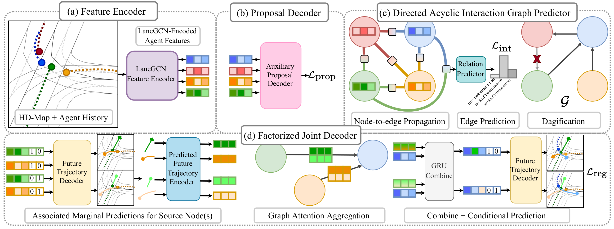
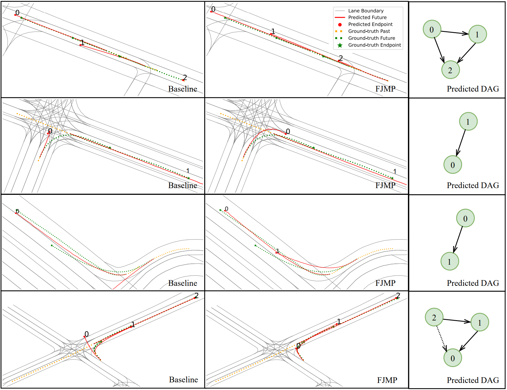
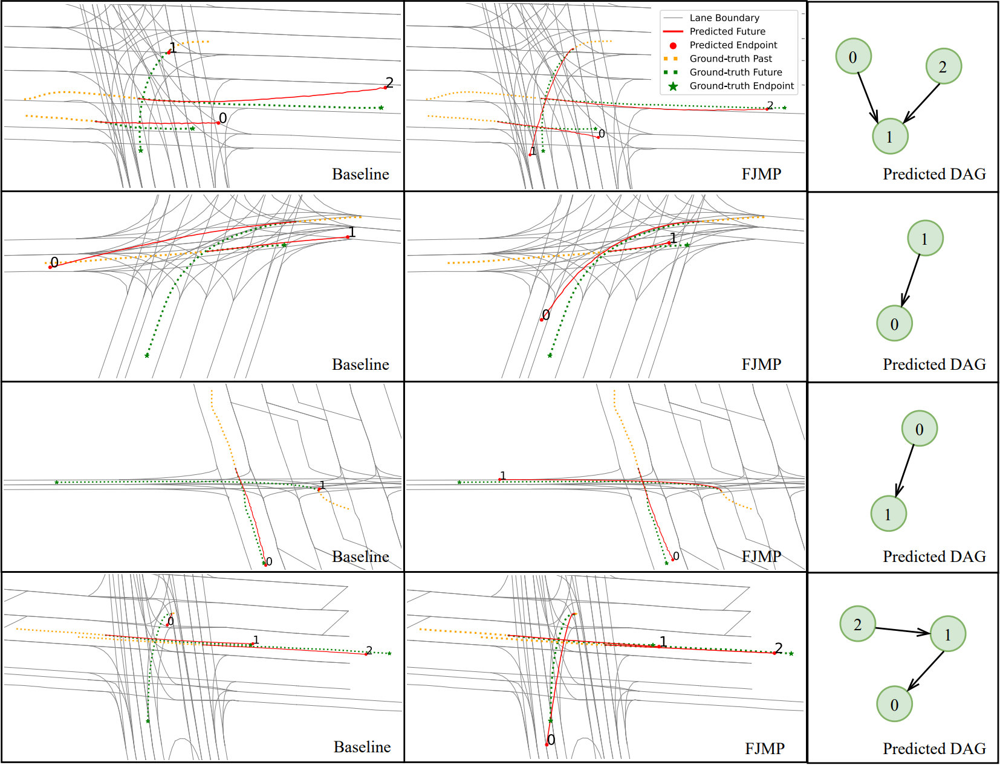

<br /><br />

TL;DR: We propose a novel approach to multi-agent joint motion prediction for autonomous driving, where we factorize joint prediction into a sequence of marginal and conditional predictions over a learned directed acyclic interaction graph. Our proposed factorization technique enhances reasoning about multi-agent interactions, leading to state-of-the-art joint prediction performance that outperforms non-factorized approaches.

**Ranks 1st** on the [INTERACTION Multi-Agent Prediction Benchmark](http://challenge.interaction-dataset.com/leader-board)

## Abstract

Predicting the future motion of road agents is a critical task in an autonomous driving pipeline. In this work, we address the problem of generating a set of scene-level, or joint, future trajectory predictions in multi-agent driving scenarios. To this end, we propose FJMP, a Factorized Joint Motion Prediction framework for multi-agent interactive driving scenarios. FJMP models the future scene interaction dynamics as a sparse directed interaction graph, where edges denote explicit interactions between agents. We then prune the graph into a directed acyclic graph (DAG) and decompose the joint prediction task into a sequence of marginal and conditional predictions according to the partial ordering of the DAG, where joint future trajectories are decoded using a directed acyclic graph neural network (DAGNN). We conduct experiments on the INTERACTION and Argoverse 2 datasets and demonstrate that FJMP produces more accurate and scene-consistent joint trajectory predictions than non-factorized approaches, especially on the most interactive and kinematically interesting agents. FJMP ranks 1st on the multi-agent test leaderboard of the INTERACTION dataset.

## Method



(a) Agent histories and the HD-Map are first processed by a LaneGCN-inspired feature encoder. (b) During training, the LaneGCN-encoded features are fed into an auxiliary future proposal decoder trained with a regression loss to encourage the LaneGCN features to be future-aware. (c) The future-aware LaneGCN-features are processed by a GNN that predicts the pairwise influencer-reactor relationships supervised by a focal loss. A directed interaction graph is constructed from
the predicted edge probabilities and cycles are efficiently removed using Johnson's algorithm. (d) Joint future trajectory predictions are then decoded as a sequence of marginal and conditional predictions according to the partial ordering of the DAG, whereby marginal predictions are generated for the source node(s) in the DAG and conditional predictions are generated for non-source nodes that condition on the predicted future of their parents in the DAG. Concretely, the predicted DAG and future-aware LaneGCN features are fed into a factorized DAGNN-based trajectory decoder, which produces _K_ (_K = 2_ shown above) factorized joint futures in parallel and is supervised by a joint regression loss.

## Examples

The examples below demonstrate how factorization helps with reasoning in interactive leader-follower and pass-yield scenarios. FJMP is compared with a non-factorized baseline.

**Leader-Follower Scenarios**



**Pass-Yield Scenarios**



## Citation

```bibtex
@InProceedings{rowe2023fjmp,
  title={FJMP: Factorized Joint Multi-Agent Motion Prediction over Learned Directed Acyclic Interaction Graphs},
  author={Rowe, Luke and Ethier, Martin and Dykhne, Eli-Henry and Czarnecki, Krzysztof},
  booktitle = {Proceedings of the IEEE/CVF Conference on Computer Vision and Pattern Recognition (CVPR)},
  year={2023}
}
```
